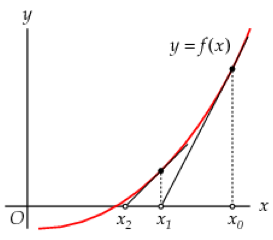

# Finding roots to nonlinear equations

One of the most basic mathematical tasks applied to scientific problem solving is that of finding the zeroes of a function, or equivalently, the roots of an equation. Many situations require the finding the roots of a system of equations or a single equation. For example, the location of the maxima and minima of a function describing some system requires finding the zeroes of the derivatives of that function.

The solution of a linear equation in one variable or a system of linear equations in more than one variables are taught at secondary school and in higher education during linear algebra courses. The solution of nonlinear systems of algebraic equations is frequently not possible using formal analytic methods, as it is in for linear systems. Hence it is necessary to resort to iterative numerical methods to solve such systems. 

In this problem set only methods for the solution of a single nonlinear equation in one variable will be discussed and implemented in Python. Henceforth it is assumed that $$f(x)$$ is a continuous function defined on an interval $$[a, b]$$, with $$f(a)$$ and $$f(b)$$ of opposite sign. The *intermediate value theorem* guarantees the existence of a number $$r$$ in $$(a, b)$$ with $$f(r) = 0$$.

## Bisection method

The Bisection Method is a special case of a bracketing method. In a such method, one starts with the knowledge that a zero lies in some interval, so that it is only necessary to refine the knowledge of the interval so that the interval containing the zero has a length that is smaller than the required precision for the zero.

The Bisection Method is based on repeated halving of subintervals of $$[a, b]$$ and, at each step, locating the half containing $$r$$. One starts with the given interval $$[a, b]$$ and first determines whether the number $$r$$ happens to be equal to $$(a+b)/2$$ and, if not, can be found in the subinterval $$[a, (a+b)/2]$$ or $$[(a+b)/2, b]$$. The choice depends on the value of $$f((a+b)/2)$$. One stops  the process of halving subintervals whenever a zero has been found or the length of the interval has become less than a specified tolerance. In the latter case, one takes the midpoint of the last found subinterval as an approximated value for the zero $$r$$.

### Problem a

Implement the Bisection method in Python, i.e., define a function

    def bisection_solve(f, a, b, tolerance=0.001, iterations=100):
        """
        Find the zero of a function f between a and b using the
        Bisection Method with tolerance (default: 0.001) and 
        maximum number of iterations (default: 1000)
        """

Apply your function `bisection_solve` to the function $$f(x)=x^3 + 2x - 1$$ and the interval $$[0,1]$$ with the default tolerance and a tolerance of 0.00001.

### Problem b

Adjust your function so it also returns the number of iterations used to arrive at the solution within a given tolerance.  Use your adapted function to generate a list of required iterations for tolerances $$0.1, 0.01, 0.001, ..., 10^-15$$.

# Regula falsi method

The Biection Method is very simple, but generally quite inefficient, in part because it only makes use of the sign of the function *f* (*x*) at each evaluation, while ignoring its magnitude. Thus it ignores significant information which could be used accelerate the finding of the root. A method based on interpolation makes use of this information by approximating the function on the interval $$[x_1, x_2]$$ by the chord joining the points $$(x_1,f(x_1)$$ and $$(x_2,f(x_2)$$, which is the straight line:

$$(y-y_1)/(x-x_1) = (y_2-y_1)/(x_2-x_1)$$

Solving this linear equation for $$y=0$$ yields the new interval endpoint within the interval $$[x_1, x_2]$$:

$$x_3 = x_1 - f(x_1)(x_2-x_1)/(f(x_2)-f(x_1))$$.

The choice between the two intervals $$[x_1, x_3]$$ and $$[x_3, x_2]$$ is decided by evaluating $$f(x_3)$$ and discarding the interval whose endpoints have the same sign, as was done in the Bisection method. This iteration process is repeated, but it will converge more quickly than the Bisection method, since the information about the magnitude of $$f(x)$$ pushes the $$x_3$$ value more quickly towards the actual root. The iteration is continued until the end points of the interval show no change to the required precision in subsequent iterations.

### Problem c

Implement the Regula Falsi method in Python, i.e., define a function

    def regula_falsi_solve(f, x1, x2, tolerance=0.001, iterations=100):
        """
        Find the zero of a function f between x1 and x2 using the Regula 
        Falsi Method with tolerance (default: 0.001) and maximum
        number of iterations (default: 1000)
        """  

Define your function such that it also returns the number of iterations         used to arrive at the solution within a given tolerance.  Use your adapted function to generate a list of required iterations for tolerances $$0.1, 0.01, 0.001, ..., 10^-15$$. Verify that this method works indeed faster than the Bisection Method.

## Secant method

The Secant method closely resembles the Regula Falsi method in using a linear approximation to $$f(x)$$ at each iteration, but with the bracketing aspect dropped. Unlike the regula falsi method, the initial points do not necessarily enclose a point where we know a zero of $$f(x)$$ exists.

In the secant method, the function $$f(x)$$ is being approximated by a straight line which is an extrapolation based on the two points $$x_0$$ and $$x_1$$. The line passing through the points $$(x_0, f(x_0))$$ and $$(x_1, f(x_1))$$ can be seen to be given by

$$y-f_1 = (x-x_1)(f_1-f_0)/(x_1-x_0)$$.

Solving for the value of $$x$$ for which $$y=0$$ for this line, gives the two-point iteration formula

$$x_(k+1)=x_k-f(x_k)(x_k-x_(k-1))/(f(x_k)-f(x_(k-1))$$.

Thus, starting with the two initial approximations $$x_0$$ and $$x_1$$, the approximation $$x_2$$ is the $$x$$-intercept of the line joining $$(x_0, f(x_0))$$ and $$(x_1, f(x_1))$$. The approximation $$x_3$$ is the $$x$$-intercept of the line joining $$(x_1, f(x_1))$$ and $$(x_2, f(x_2))$$, and so on.

While both the regula falsi and secant methods use the idea of a linear approximation to the function based on its values at two points, the regula falsi method depends on the fact that those two points enclose a zero, with the consequent sign change for $$f(x)$$, while the secant method simply extrapolates using these two points to find the next approximation to the zero. The regula falsi method is sure to find the zero, since it keeps it bracketed, while the secant method can sometimes fail to find a zero that does exist. The secant method has the advantage that we do not need to have prior knowledge of the interval in $$x$$ in which each zero of $$f(x)$$ lies.

### Problem d

Implement the secant method in Python, i.e., define a function

    def secant_solve(f, x0, x1, tolerance=0.001, iterations=100):
        """
        Find the zero of a function f with initial approximations x0 and
        x1 using the Secant Method with tolerance (default: 0.001)
        and maximum number of iterations (default: 1000)
        """

Define your function such that it also returns the number of iterations used to arrive at the solution within a given tolerance. Use your adapted function to generate a list of required iterations for tolerances $$0.1, 0.01, 0.001, ..., 10^-15$$. Verify that this method also works faster than the Bisection Method.

## Newton-Rhapson method

Bracketing methods are useful when one has a well-established interval in which a sign change takes place for a continuous function. If the function is monotonic on that interval, one knows that the zero is unique and methods such as bisection and regula falsi are sure to find it. If the function is not monotonic, it is difficult to ensure that all the zeroes on the interval are found. In addition, these bracketing methods are somewhat slow in their convergence to the zero, since they do not make much use of local knowledge of the function $$f(x)$$. In contrast, the Newton-Raphson method makes explicit use of the derivative of the function of which we wish to find the zero.

Suppose one has reason to believe that there is a zero of $$f(x)$$ near the point $$x_0$$. The Taylor expansion for $$f(x)$$ about $$x_0$$ can then be written as

$$f(x)=f(x_0)+f'(x_0)(x-x_0)+(f''(x_0))/(2!)(x-x_0)^2+...$$.

Dropping the terms of this expansion beyond the first order term, one gets:

$$f(x)~~f(x_0)+f'(x_0)(x-x_0)$$

Setting $$f(x) = 0$$ to find the next approximation, $$x_1$$, to the zero of $$f(x)$$, one finds

$$x_1 = x_0 - f(x_0) / (f'(x_0))$$.

This provides an iteration scheme which may well converge on the zero of $$f(x)$$, under appropriate conditions. It can be shown that the Newton-Raphson method converges in the interval where

$$
|(f(x)f''(x)) / (f'(x))^2 | < 1
$$

The Newton iteration can be motivated geometrically in the following way. Suppose that $$f$$ is a function of which we want to find a zero. Start with an initial guess $$x_0$$ for the zero (see Figure 1).

  
<small>Figure 1. Visualization of the Newton iteration.</small>

Now draw the tangent line to the graph of $$f$$ in the point $$(x_0, f(x_0))$$.

**Exercise.** Prove that the tangent line to the graph of $$f$$ in the point   $$(x_0, f(x_0))$$ intersects the $$x$$-axis in the point

$$(x_0 - f(x_0) / (f'(x_0)), 0)$$.

The $$x$$-coordinate of the intersection point just found we denote by $$x_0$$.

Thus: $$x_1 = x_0 - f(x_0) / (f'(x_0))$$. Figure 1 suggests that where $$x$$ is close to a zero of $$f$$, $$x$$ is a much better approximation of the root. When you apply the previous tangent line technique to $$x_1$$ instead of to $$x_0$$,
then you may expect a much-improved approximation $$x_2 = x_1 - f(x_1) / (f'(x_1))$$. And you may continue in this way. In step $$n+1$$ you use the formula

$$x_(n+1) = x_n - f(x_n) / (f'(x_n))$$.

This recursion formula can also be written as follows:

$$x_(n+1) = g(x)$$, with $$g(x) = x - f(x) / (f'(x))$$.

Please note that the Newton-Raphson Method assumes that one has both the function and its derivative at one disposal.

### Problem e

Implement the Newon-Raphson method in Python, i.e., define a function

    def NewtonRaphson_solve(f, fp, x0, tolerance=0.001, iterations=100):
        """
        Find the zero of a function f with derivative fp starting
        With initial approximation x0 using the Secant Method with
        tolerance (default: 0.001) and maximum number of
        iterations (default: 1000)
        """

Define your function such that it also returns the number of iterations used to arrive at the solution within a given tolerance. Use your adapted function to generate a list of required iterations for tolerances $$0.1, 0.01, 0.001, ... 10^(-15)$$ starting at $$x_0 = 0.5$$. Verify that this method also works faster than the Bisection Method.

##Aftermath

In the field that is known as Numerical Mathematics researchers are busy with studying the behavior of approximate methods and smart adaptations of the method of Newton-Raphson have been developed that have a higher order of convergence. Here we mention some formulas of order 3 and 4, i.e., methods in which the number of correct digits triples and quadruples in each iteration steps. Note that the Normal-Raphson method has quadratic order. It is convenient to use the auxiliary function $$h(x) = (f(x)*f''(x)) / (f'(x))^2$$. All formulas are shaped like

$$x_(n+1) = x_n - f(x_n) / (f'(x_n)) * (1 + (h(x_n)) / (2(1-c(x_n)*h(x_n))))$$

for some function $$c(x)$$ and we assume that all needed derivatives in the approximated zero of $$f$$ are unequal to zero so that division by zero does not occur in the formulas.

### Order of convergence $$ = 3$$

$$c(x) = 0$$: formula of Chebyshev $$x_(n+1) = x_n - f(x_n) / (f'(x_n)) * (1 + (h(x_n)) / 2)$$

$$c(x) = (1/2)$$: formula of Halley $$x_(n+1) = x_n - f(x_n) / ((f'(x_n)) * (1 - (h(x_n)) / 2))$$

### Order of convergence $$ = 4$$

$$c(x) = 1 - (f'''(x)*f'(x)) / (3(f''(x))^2)$$

