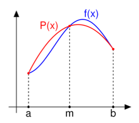
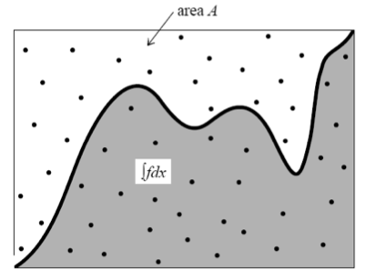

# Numerical Integration

In numerical analysis one studies various methods to approximate definite integrals. In this problem set, two techniques are considered: (1) numerical quadrature; (2) Monte Carlo method.

## Numerical quadrature

Numerical quadrature is a basic method of numerical integration of a definite integral $$int_a^bf(x)dx$$ of a function $$f(x)$$ on an interval $$[a,b]$$. It uses a partition of the interval $$[a,b]$$ in subintervals and a selection of one node in each subinterval. For a sequence of distinct nodes

$$a <= x_1 < x_2 < ... < x_n <= b$$

one creates a sum of the type

$$sum_(i=1)^n a_i*f(x_i)$$

to approximate $$int_a^bf(x)dx$$. In other words, a weighted sum of function
values in a number of nodes in the interval approximates the definite integral.
The exact formula depends on the numerical integration method chosen and can be
specified by first explaining what approximation holds for an interval $$[a,b]$$
and then applying this to each subinterval in a given partition of the
interval. In the methods below the interval is always split into subintervals
of equal length, viz., of length $$(b-a)/n$$. A large class of quadrature rules
can be derived by constructing interpolating function that are easy to
integrate.

## Riemann summation

The following three choices for selecting  a node in a subinterval are distinguished:

1. Always the left endpoint of the subinterval (Left Riemann sum)
2. Always the right endpoint of the subinterval (Right Riemann sum)
3. Always the midpoint of the subinterval (Middle Riemann sum)

Taking $$dx = (b-a)/n$$, the choices correspond with the following formulas, respectively:

1. Left Riemann sum: $$sum_(i=0)^(n-1) dx\*f(a+i\*dx)$$
2. Right Riemann sum: $$sum_(i=1)^(n) dx\*f(a+i\*dx)$$
3. Middle Riemann sum: $$sum_(i=0)^(n-1) dx\*f(a+(i+1/2)\*dx)$$

## Trapezoidal Rule

The trapezoidal rule, also known as the trapezoid rule or trapezium rule, can be derived by approximating, as shown in Figure,  the integrand $$f(x)$$ (in blue) by the linear function $$P(x)$$ (in red) through the point $$(a, f(a))$$ and $$(b, f(b))$$.

> 
 
The definite integral of the function $$f(x)$$ on the interval $$[a,b]$$ is now approximated by the definite integral of the linear function $$P(x)$$ on the interval $$[a,b]$$. The latter definite integral can be computed analytically and leads to the following approximation:

$$int_a^b f(x) dx ~~ (b-a)/2[f(a)+f(b)]$$.

This formula corresponds to the so-called closed 2-point Newton-Cotes quadrature rule.

Taking an equidistant partition of the interval $$[a,b]$$ into $$n$$ subintervals $$dx = (b-a)/n$$, the trapezoidal rule corresponds with the following formula:

$$int_a^b f(x) dx =$$
$$sum_(i=0)^(n-1) 1/2 dx\*[f(a+i\*dx)+f(a+(i+1)\*dx)] =$$ $$dx\*[1/2f(a)+(sum_(i=1)^(n-2)f(a+i\*dx))+1/2f(b)]$$
 
## Simpson's Rule

Simpson's rule can be derived by approximating, as shown in Figure,  the integrand $$f(x)$$ (in blue) by the quadratic function $$P(x)$$ (in red) through the point $$(a, f(a)), (m, f(m))$$ and $$(b, f(b))$$, where the midpoint $$m = (a+b)/2$$.

The definite integral of the function $$f(x)$$ in the interval $$[a,b]$$ is now approximated by the definite integral of the quadratic function $$P(x)$$ in the interval $$[a,b]$$. The latter definite integral can be computed analytically and leads to the following approximation:

$$int_a^b f(x) dx ~~ (b-a)/6[f(a)+4f((a+b)/2)+f(b)]$$

Simpson's rule also corresponds to the so-called closed 3-point Newton-Cotes quadrature rule.  

Taking an equidistant partition of the interval $$[a,b]$$ into $$n$$ subintervals $$dx = (b-a)/n$$, the trapezoidal rule corresponds with the following formula:

$$int_a^b f(x) dx =$$
$$sum_(i=0)^(n-1) 1/6 dx\*[f(a+i\*dx)+4f(a+(i+1/2)\*dx) + f(a+(i+1)\*dx)] =$$ 
$$dx*[1/6f(a)+2/3f(a+1/2dx)+(sum_(i=1)^(n-1) 1/3f(a+i\*dx)+2/3f(a+(i+1/2)\*dx))+1/6 f(b)]$$
 
### Problem a

Implement all previously discussed numerical integration methods in Python and apply them to compare the numerical approximation with a partition of the interval $$[0,1]$$ in 100 subintervals with the exact results for the following two cases:

* $$ int_0^1 4/(x^2+1) dx = pi $$
* $$ int_0^pi sin(x) dx = 2 $$

You can approximate $$pi$$ in your Python program by the floating point number $$3.141592653589793$$ or use the variable `math.pi` from the imported  `math` module.

### Problem b

1. For each previously defined numerical integration method, explore how many subintervals are needed to approximate $$ int_0^1 4/(x^2+1) dx $$ within a precision of 0.1, 0.01, 0.001, and 0.0001.

2. For each previously defined numerical integration method, explore how many subintervals are needed to approximate $$ int_0^pi sin(x) dx$$ within a precision of 1 up to 7 digits after the decimal point.

3. Answer in the comments at the top of your program: which method is certainly most efficient? Which one comes next?

## Monte Carlo Integration

In scientific computing, a Monte Carlo method is a method which solves a problem by generating suitable random numbers and observing that fraction of the numbers obeying some property or properties. Monte Carlo integration of a function $$f(x)$$ over an interval is based on the calculation of the area under the curve of the function, denoted as region $$A_f$$ , in the following way: Select a region $$A$$ in the coordinate plane that contains $$A_f$$  and for which the area is easily calculated (usually one chooses a rectangular area). Uniformly pick random points in region $$A$$ and check whether the points are within region $$A_f$$ or not. Estimate the area of $$A_f$$ as the area of $$A$$ multiplied by the fraction of points falling within $$A_f$$.

Thus, once the search area $$A$$ has been chosen, the Monte Carlo method consists of the following steps (cf. Figure):

* uniformly sample points in region $$A$$;
* calculate the proportion $$p$$ of points in the region of interest, i.e. within $$A_f$$;
* area under the curve = $$ p x * "area of A" $$.

The above picture suggest that one chooses a region $$A$$ as closely around $$A_f$$ as possible, but this is not necessary. The steps of the algorithm of numerically approximating $$int_a^b f(x) dx$$ on the interval $$[a,b]$$ for a nonnegative function can be written down as follows:

1. Define a region around the area of interest, i.e., define $$x_min$$, $$x_max$$, $$y_min$$, $$y_max$$ such that $$a<=x_min, x_max<=b$$ and also $$y_min<=f(x)<=y_max$$ for all $$x$$ within $$[a,b]$$.

2. Uniformly sample points in the chosen rectangular region and determine how many are within the area of interest. The sampling of point is done by repeated random generation of a point $$(x,y)$$ by random generation of $$x$$ in $$[xmin, xmax]$$ and by random generation of $$y$$ in $$[ymin, ymax]$$. The generated point is good, i.e., within the region of interest , when $$y<=f(x)$$.

	Note that this definition of goodness of a point depends on the property of being a positive function; for negative functions the definition of goodness is just opposite. One can also implement the general case in which area under the $$x$$-axis is considered negative.

3. The numerical approximation of the integral $$int_a^b f(x) dx$$ is equal to the fraction of the points in the search region times the area of the search region. In this case:

	$$int_a^b f(x) dx = 	N_\"good\"/(N_\"good\"+N_\"wrong\")(x_max-x_min)(y_max-y_min)$$.
 
### Problem c

Implement Monte Carlo integration in Python and apply it to compare the numerical approximation for a sample of 100000 points with the exact results for the following two cases:

* $$ int_0^1 4/(x^2+1) dx = pi $$
* $$ int_0^pi sin(x) dx = 2 $$

You can approximate $$pi$$ in your Python program by the floating point number $$3.141592653589793$$.

To generate within Python a uniformly random number in $$[0, 1]$$, you can import the `random` module and generate a number by the function call `random.random()`.  To generate within Python a uniformly random number in the interval $$[a, b]$$, you can import the `random` module and generate a number by the function call $$random.uniform(a,b)$$.

### Problem d

Explore how many sample points are on average needed to approximate $$int_0^1 4/(x^2+1) dx$$ within a precision of $$0.1, 0.01, 0.001, and 0.0001$$.

### Problem e

Compare the result of the previous problem d with the following probabilistic algorithm for approximating $$int_a^b f(x) dx$$ on the interval $$[a,b]$$: Uniformly sample points on the interval $$[a,b]$$. Compute the average function value of these sample point and multiply by $$(b-a)$$. The value found is for a large sample of point near the value of the definite integral.

## Vectorized Implementation

A faster implementation of the previously discussed integration methods can be achieved by using the numpy module and doing the computation with arrays. The Monte Carlo integration could be implemented as follows for positive function:

	from numpy import *
	
	def monte_carlo_integral(f, a, b, samplesize):
	    # assuming a positive function on the interval [a,b]
	    x_min = float(a)
	    x_max = float(b)

	    # determine y_max
	    x = linspace(x_min,x_max,sampleSize)
	    y = f(x)
	    y_max = amax(y)

	    # Monte Carlo sampling
	    good_points = 0
	    x = random.uniform(x_min, x_max, samplesize)
	    y = random.uniform(0, y_max, samplesize)
	    good_points = y[y < f(x)].size
	    area = (x_max - x_min) * y_max * float(good_points) / float(samplesize)
	    return area
