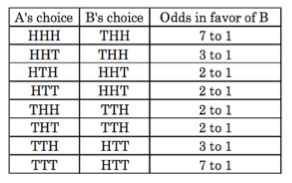

# Penney ante

This coin flipping game is known as Penney Ante after its inventor Walter
Penney. A coin is flipped until either the pattern head, head, tail (HHT) or
the pattern head, tail, tail (HTT) occurs; Alice wins if HHT comes first, Bob
wins if HTT comes first. The coin used is supposed to be fair, i.e., the
probability that it comes up heads equals one half. This implies that the
expected waiting time until HHT first occurs is the same as the expected
waiting time until HTT.

In other words, neither Bob or Alice has an advantage, if they play solitaire.
It can be shown that the game is completely different if both patterns are
considered simultaneously: Bob wins only half as often, but when he does win he
tends to win sooner. The average length of the game given that Bob (Alice) wins
is $$14/3$$ ($$17/3$$). The average game length is $$16/3$$.

## The game as an automaton

In Penney Ante, coin flips lead from state 0 to state 4 or state 5 according to
the following diagram of transitions between states:

 
You start in state 0, in which no head has occurred yet. Once a head appears,
you move to state 1. Being in state 1, a coin flip of head (tail) brings you to
state 2 (3). And so on. In the end you arrive either at state 4, in which Alice
wins, or stat 5, in which case Bob wins. From the picture it is immediately
clear that the game is not symmetric.

## Problem a: simulating the game

Write a Python program to simulate the game: create a function called `game`.
Use the function to simulate the game and verify the theoretical statistical
analysis.

## Problem b: a winning game strategy

When the game is played using patterns of length 3, no matter what sequence
Alice chooses, Bob can always make a winning selection. Here are the winning
(on average) selections for Bob (B) for each of the eight possible selections
for Alice (A).

Assuming that Alice wins if HHT comes first, Bob has the best chance of winning
if he selects the pattern THH.

Implement a Python simulation that illustrates the chance of 3/4 that Bob wins
when he selects the pattern THH in reaction to Alice's choice of HHT.
 
Hint: first create an automaton that corresponds with the coin game.

## Problem c: generalize

Select some sequence of length 3 for Alice. Given this choice of Alice, write a
Python program that determines by simulation the winning strategy for Bob in
reaction to Alice's choice.

In other words, approximate by simulation one column of the following
theoretical probabilities of winning for players A and B (for sequences of
length 3).
 

