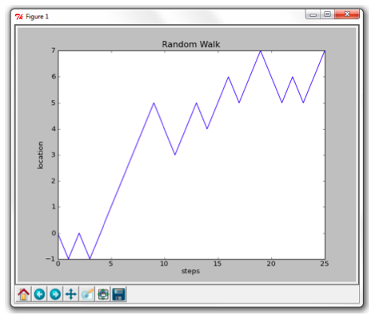

# Random Walk

## Stochastic Processes with NumPy

The NumPy module contains basic statistics functions such as `amax`, `amin`, `average`, `mean`, `median`, `var`, `std`, and `corrcoef` for maximum and minimum of an array, the weighted average, mean, variance, and standard deviation of an array of values, and the correlation
coefficient between two data arrays, respectively.

	>>> import numpy as np
	>>> data = np.random.uniform(-1, 1, 10)
	>>> data
	array(...) # TRY THIS OUT YOURSELF!
	>>> np.round(data, 3)
	array(...)
	>>> np.round(np.array([np.amin(data), np.amax(data), np.mean(data)]), 2)
	array(...)

One can plot the dataset:

	>>> plt.plot(data, 'b+', label="data")
	[<matplotlib.lines.Line2D object at 0x03B84950>]
	>>> plt.plot(np.arange(10), np.mean(data)*np.ones(10), 'r-', label="mean")
	[<matplotlib.lines.Line2D object at 0x04033BB0>]
	>>> plt.axis([-0.1, 9.1, -1.1, 1.1])
	[-0.1, 9.1, -1.1, 1.1]
	>>> plt.legend()
	<matplotlib.legend.Legend object at 0x040334B0>
	>>> plt.show()

The program below illustrates the create histograms from statistical data:

    import numpy as np
    import matplotlib.mlab as mlab
    import matplotlib.pyplot as plt

    # create data using the normal distribution
    mu, sigma = 50, 10
    x = mu + sigma*np.random.randn(10000)

    # create normalized histogram in green, transparent color
    n, bins, patches = plt.hist(x, 75, normed=True, facecolor='green', alpha=0.5)

    # format the plot
    plt.xlabel('data')
    plt.ylabel('probability')

    # One can use Latex string for labels and titles
    plt.title(r'$\mathrm{Histogram\ with}\ \mu=50,\ \sigma=15$')
    plt.axis([10, 90, 0, 0.05])
    plt.grid(True)

    # add a curve fit
    y = mlab.normpdf(bins, mu, sigma)
    plt.plot(bins, y, 'r-', linewidth=3)

    # save to file in PDF format
    # plt.savefig("C:/temp/histogram.pdf")
    # show figure
    plt.show()

### Problem a: 1-D Walk

The simplest 1-D random walk model is the Bernoulli walk in which a person takes at regular time intervals randomly a step to the left or to the right. Each step is assumed to be of the same length and to be stochastically independent of the previous one.

### Generating the Symmetric Random Walk

In the symmetric case, the probability that a person takes a step to the left is equal to the probability that he or she takes a step to the right. A step to the right we let correspond to a value of 1 (the unit step to the right) and a step to the left corresponds to a value of -1 (the unit step to the left).

These values can be generated randomly in many ways (cf., the gambler's ruin example). The NumPy module provides several functions to generate random number from a variety of probability distributions.
 
Task: Use the `random_integers` function of the `numpy.random` subpackage to generate efficiently (i.e. via vectorization of programming code) a random sequence of integers -1 and 1 with sample size equal to 10000. Verify that the random sequence corresponds with a symmetric stochastic process. Then, create a random sequence of -1's and 1's of length 25 to compute further with; give this array the name steps.

An array of the locations of this one-dimensional walk can be calculated as a cumulative sum of the elements of `steps` via the NumPy function `cumsum`. Prepend an array with a single 0 to ensure that the random walk starts in the origin. Each element of this newly created array represents how many steps to the left or right from the origin the walker is away from the origin.

Task: Visualize the generated one-dimensional random walk by plotting the location of the random walker in number of steps to the right (positive value) or to the left (negative value) against the number of steps made since he or she left the origin. Your picture should be similar to

You should not upload the plot, only the code to generate the plot.

### Analysis of the Bernoulli Walk

You can ask yourself many questions about Bernoulli walks:

* What is the expectation value of the position after n steps?

* What is the expectation value of the distance and square distance between the position after $$n$$ steps and the origin?

* What is the probability that the walker returns to the origin as the number of steps approaches infinity?

* and so on.

We only address the first question for the general Bernoulli walk when p is the probability of taking a step to the right and $$q$$ is the probability of taking a step to the left ($$q=1-p$$). We shall specialize each time our answers for the symmetric case $$p=q=1/2$$ and we shall sometimes do a simulation to illustrate a specialized answer. In this way you will see how useful Python is in the analysis of random walks.

### Average Position and Square Distance to the Origin after $$n$$ Steps

Let $$k$$ be the number of steps to the right. The probability $$P_n(k)$$ of taking $$k$$ such steps out of $$n$$ is given by the binomial formula

$$P_n(k) = ((n),(k))p^k q^(n-k)$$.

If $$k$$ steps are to the right, then the horizontal position $$x$$ of this walk is equal to $$2k – n$$. So, the average horizontal position $$(:x:)$$ after $$n$$ steps is

$$(:x:) = sum_(k=0)^n (2k-n)P_n(k)$$.

This sum can be computed exactly and the result is $$(:x:) = n(p-q)$$.

In the symmetric case, the expectation value of the horizontal position after $$n$$ steps is equal to 0. The expectation value of the square distance $$(:d^2:)$$ of the random walker after n steps to the origin can be determined in a similar way; the result is

$$(:d^2:)=4pqn+(p-q)^2n^2$$.

The variance in the final position of the random walker after $$n$$ steps can now be computed and turns out to be equal to $$sigma_x^2=4pqn$$.

The variance of the square distance can also be determined in the form of an exact formula (we leave out the details and the formula). We only mention that the formula specializes in the symmetric case as follows:

* for the position: $$(:x:)=0$$ and $$sigma_x^2=n$$;
* for the square distance: $$(:d^2:) = n$$ and $$(sigma_(d^2))^2 = 2(n-1)n$$.

Task: Simulate $$n$$-step symmetric one-dimensional random walks and check what the mean position and the mean square distance from the endpoint of the walk to the origin are in this case. In other words, simulate a number of random walks, say 100 walks, and statistically analyze the results. For example, make a histogram of the computed end position and squared distance to the origin. Compute mean values and variances. Compare your results with the above theoretical results, and *describe the differences in clearly marked comments*.

### A Random Walk with Variable Step Length

Consider the following one-dimensional random walk:

* the probability of the random walker taking a step to the right is equal to 1/2;
* the probability of the random walker taking a step to the left is equal to 1/2;
* the size of one step is uniformly distributed between 0 and 1.

Tasks:

* (a) Write a procedure randomWalk to generate the random walk
* (b) Write a procedure to visualize the random walk.
* (c) Use your routines to analyze the random walk problem statistically.

### Problem b: 2-D Lattice Walk

A random walk in higher dimensions is more complicated than a one-dimensional random walk. We shall restrict ourselves to random walks on a two-dimensional square lattice where in each step a motion from one lattice point to a neighboring lattice point occurs.

### Generating the Symmetric Random Walk

The set of possible movements in one step from a lattice point to a neighboring point depends on the notion of neighborhood. Two commonly used neighborhoods:

* The von Neumann neighborhood
 
 There are 4 directions: north, south, east, west. They correspond with steps $$(0,1)$$, $$(0,-1)$$, $$(1,0)$$, and $$(-1,0)$$, respectively. For a symmetric random walk steps all probabilities are equal to $$1/4$$.

* The Moore neighborhood

 There are 8 directions: north, north, south, east, west, northeast, southeast, southwest, and northwest. They correspond with steps $$(0,1)$$, $$(0,-1)$$, $$(1,0)$$, $$(-1,0)$$, $$(1,1)$$, $$(1,-1)$$, $$(-1,-1)$$, and $$(-1,1)$$, respectively.

Tasks: Write a Python program that can generate and visualize a random lattice walk based on the von Neumann neighborhood. Also run simulations to study the mean square distance from the endpoint of the walk to the origin in an $$n$$-step symmetric two-dimensional lattice walk using the von Neumann neighborhood. Can you guess from your simulations how the mean square distance depends on the number of steps?

Repeat the previous task for a 2-D lattice walk based on the Moore neighborhood.

